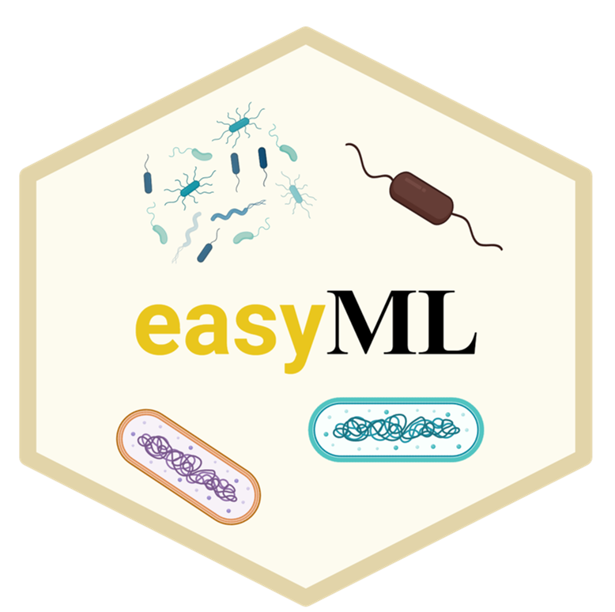

# EasyML
A User-Friendly Python Package for Microbiome Machine Learning Research.
<br/><br/>
<p align="center"></p>

## Background


## Installation
```commandline
pip install git+https://github.com/yhshengjy/EasyML.git
```
## Quick Start

### Model building

## License

This software is licensed under the MIT license. See the [LICENSE](LICENSE) file for details.
