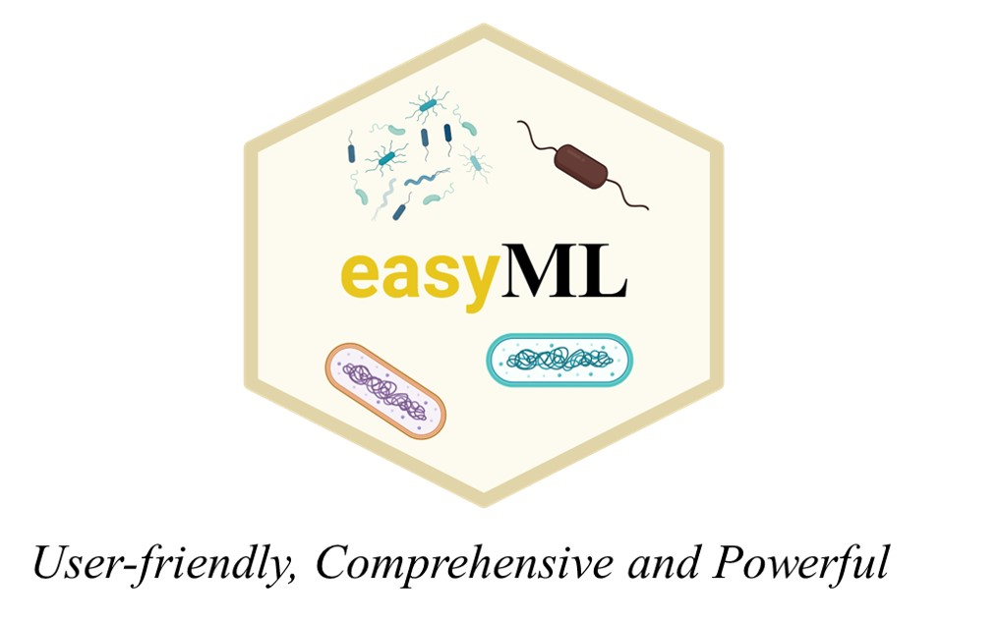

# EasyML
A User-Friendly Python Package for Microbiome Machine Learning Research.
<br/><br/>
<p align="center"></p>

## Background
Machine learning (ML) has emerged as a powerful tool in microbiome research, capable of uncovering patterns that elude traditional methods, yet its complexity often limits accessibility. To address this barrier, we introduce easyML in this study—a python package specifically designed to facilitate microbiome machine learning. easyML supports both single-study modeling and cross-study meta-analysis, streamlining complex analytical processes with pre-configured workflows that allow entire analyses to be completed with a single line of code, and typically, general analyses require no more than 10 lines of code. This package makes advanced machine learning techniques more accessible to researchers across varying levels of expertise. 

## Installation
```commandline
pip install git+https://github.com/yhshengjy/EasyML.git
```
## Quick Start

### Model building
```python
from easyml import easyML

# Create an easyML object, specifying the dataset path, whether to split the data, case type (IBD), 
#target variable (disease), and whether to stratify the split by the target label
eml = easyML(filename='e:/easyML-case/IBD.csv',
             split=True, 
             case='IBD',
             target='disease',
             stratify=True
            )

# Preprocess the data and set the random seed to 1 for reproducibility
eml.preprocess_data(random_state=1)

# Train models using RandomForest, ExtraTrees, GBM and GradientBoosting, 
# performing 50 iterations of hyperparameter optimization
eml.train_model(model_names=['RandomForest', 
                             'ExtraTrees', 
                             'GradientBoosting',
                             'XGBoost'
                            ],
               n_iter=50)


# Evaluate model performance using various metrics, including ROC AUC, F1, accuracy, precision, recall, and MCC, 
# and generate ROC and PR curve plots, saving them to the specified directory
eml.evaluate_model(scoring=['roc_auc','f1','accuracy','precision','recall','mcc'],
                   plot_model=True, 
                   plot_savedir='e:/easyML-case/')

# Automatically select the best-performing model
eml.auto_select_model()

# Evaluate model performance on the test set using the same metrics as before, and save ROC and PR curve plots to the specified directory
eml.evaluate_model(holdout='test',
                   scoring=['roc_auc','f1','accuracy','precision','recall','mcc'],
                   plot_model=True, 
                   plot_savedir='e:/easyML-case/')

# Interpret the model using the SHAP method for samples with index 0 and 1, 
#saving the interpretation results to the specified directory, with the show option set to False
eml.interpret_model(method='shap',index=[0,1], plot_savedir='e:/easyML-case/', show=False)

# Calculate model specificity for multiple diseases, using packaged data, and save the results to the specified path
eml.model_specificity(disease=['ACVD', 'T2D', 'T1D', 'CRC', 'PD'], use_packagedata=True,
                      plot_path='e:/easyML-case/')
```
### Simplifying ML pipelines to a single line
```python
# One-liner to train a complete model pipeline from data
oneliner_train_model(filename='e:/easyML-case/IBD.csv',
                     split=False, 
                     case='IBD',
                     target='disease',
                     stratify=True,
                     search_methods='bayesian',
                     plot_savedir='e:/easyML-case/')

# One-liner for study-to-study transfer learning
evaluation_results, eml_instances = study_to_study_transfer(filename="e:/easyML-case/datasets/", 
                                                            case='IBD',
                                                            model_name='RandomForest',   
                                                            target='disease',
                                                            group='subject_id',
                                                            cv=['StratifiedGroupKFold','StratifiedGroupKFold','StratifiedKFold'],
                                                            scoring='roc_auc',
                                                            plotpath='e:/easyML-case/',
                                                            random_state=1)

# One-liner for leave-one-study-out evaluation
evaluation_results_loco = leave_one_study_out(filename="e:/easyML-case/datasets/", 
                                              case='IBD',
                                              target='disease',
                                              model_name='RandomForest',
                                              group='subject_id',
                                              cv='StratifiedGroupKFold',
                                              scoring='roc_auc',
                                              plotpath='e:/easyML-case/',  
                                              random_state=1)
```

## License

This software is licensed under the MIT license. See the [LICENSE](LICENSE) file for details.
